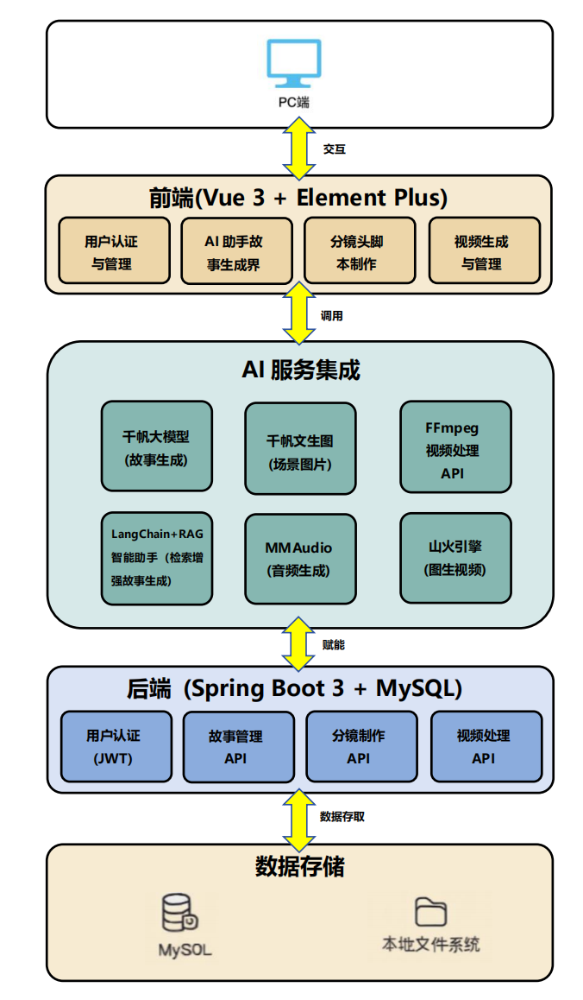

# Genvi AI短片自动创作系统

本人制作的基于AI的全流程AI短视频创作系统，基于SpringBoot + Vue + 大模型调用，支持用户输入简单的故事创意到完整的AI成片输出的完整流程，全程均由AI大模型赋能，提供极大的便利性与用户自由度。
## 系统AI短片生成流程图
### AI短片创作流程说明
本系统通过调用AI大模型API和多模态生成技术，实现从简单的故事梗概到生成AI短片全片的全流程自动化流程，系统流程图如下所示。


**1. 输入故事梗概**  
- 用户在界面中输入一个简短的故事梗概（如：“勇士拯救村庄”）。

**2. 生成初步分镜脚本**  
- 系统将用户输入提交给千帆 LLM 大模型，生成分镜脚本（包含场景序号与基本内容）。

**3. 生成文生图/视频提示词**  
- 系统将分镜脚本中的场景内容再次提交给大模型，提取：
  - 文生图提示词（生成场景图片用）
  - 图生视频提示词（生成分段视频用）

**4. 生成场景图片**  
- 用户点击“生成图片”按钮。
- 系统为每个场景生成对应图片。

**5. 生成分段视频**  
- 系统调用 **山火大模型 API**，根据图片及视频提示词生成分段视频。
- 分段视频保存至 **分段视频表单**。

**6. 选择音乐与生成最终短片**  
- 用户选择心仪的背景音乐。
- 点击“生成最终视频”按钮。
- 系统将分段视频与音乐合成完整短片。
- 最终短片保存至 **最终视频表单**。

**7. 生成完成**  
- AI短片生成成功，用户可在线预览或下载。

## 核心功能

### AI故事生成
- **智能故事创作**：基于千帆大模型，输入标题自动生成完整故事梗概
- **LangChain+RAG增强**：集成检索增强生成技术，利用本地知识库提供丰富的创作素材
- **交互式编辑**：支持多轮对话式故事修改和优化
- **故事管理**：个人故事库，支持保存、查看、删除操作

### AI分镜制作
- **智能分镜**：自动将故事拆分为多个视觉场景
- **图像生成**：每个场景自动生成对应的AI图片
- **风格定制**：多种视觉风格选择（电影感、卡通、写实等）
- **手动调优**：支持重新生成单个场景的图片

### AI视频生成
- **图生视频**：将静态图片转换为动态视频片段
- **智能剪辑**：自动拼接多个场景生成完整短片
- **音效增强**：基于MMAudio项目为视频自动添加环境音效
- **格式优化**：支持16:9比例，适配主流视频平台

### 用户系统
- **账户注册/登录**：JWT令牌认证
- **作品管理**：个人视频作品库
- **进度跟踪**：实时查看视频生成状态

## 系统架构
<div align="center">
  
</div>

### 环境要求

- **Java**: 17+
- **Node.js**: 16+
- **MySQL**: 8.0+
- **Python**: 3.8+

### 安装步骤

#### 1. 克隆项目
```bash
git clone <repository-url>
cd AI-Video-Generation-System
```

#### 2. 配置环境变量

创建配置文件：
```bash
# 后端配置
cd SpringBoot_Pro
cp env.example .env
# 编辑 .env 文件，填入你的API密钥

# 前端配置  
cd VUE_Pro/todo_front
cp env.example .env.local
# 编辑 .env.local 文件
```

**环境变量配置示例**：
```env
# 数据库配置
DB_PASSWORD=your_database_password

# JWT配置
JWT_SECRET=your_jwt_secret_key_minimum_256_bits

# 千帆API配置
QIANFAN_API_TOKEN=your_qianfan_api_token

# 山火引擎API配置
VOLCENGINE_ACCESS_KEY_ID=your_volcengine_access_key
VOLCENGINE_SECRET_ACCESS_KEY=your_volcengine_secret_key
```

#### 3. 启动后端服务
```bash
cd SpringBoot_Pro
./mvnw spring-boot:run
```

#### 4. 启动前端服务
```bash
cd VUE_Pro/todo_front
npm install
npm run dev
```

#### 5. 启动AI智能助手服务 (LangChain+RAG)
```bash
cd ai_agent
pip install -r requirements.txt

# 配置环境变量
export DEEPSEEK_API_KEY=your_deepseek_key
export QIANFAN_API_KEY=your_qianfan_key

# 启动FastAPI服务
python app.py
```

### 访问系统

- **前端界面**: http://localhost:3000
- **后端API**: http://localhost:8080
- **AI助手服务**: http://localhost:8000
- **音效生成（需要自行部署MMAudio开源项目）**: http://localhost:7860

## 使用指南

### 1. 注册账户
- 访问系统首页
- 点击"注册"创建新账户
- 使用邮箱和密码登录

### 2. 创建故事
- 点击右下角"AI小助手"
- 选择"生成新故事"
- 输入故事标题，等待AI生成
- 根据需要修改故事内容

### 3. 制作分镜
- 在"我的故事"中选择已保存的故事
- 点击"制作分镜"
- 选择视觉风格
- 等待AI生成场景图片
- 可单独重新生成不满意的场景

### 4. 生成视频
- 完成分镜后进入视频生成页面
- 点击"生成视频"开始制作
- 可为每个场景添加音效
- 等待视频生成完成
- 在"我的作品"中查看成品

## 技术栈详情

### 前端技术栈
- **Vue 3**: 响应式前端框架
- **Element Plus**: UI组件库
- **Pinia**: 状态管理
- **Vue Router**: 路由管理
- **Axios**: HTTP客户端
- **@gradio/client**: Gradio服务客户端

### 后端技术栈
- **Spring Boot 3**: 微服务框架
- **Spring Security**: 安全认证
- **Spring Data JPA**: 数据访问层
- **MySQL**: 关系型数据库
- **JWT**: 无状态认证
- **OkHttp**: HTTP客户端

### AI服务集成
- **LangChain框架**: 构建智能助手的核心框架
- **RAG检索增强**: 本地知识库检索，提供丰富创作素材
- **百度千帆**: 大语言模型 + 文生图 + 知识库检索
- **DeepSeek**: 高性能语言模型，支持创意生成
- **字节山火引擎**: 图生视频
- **MMAudio**: 音效生成服务（开源项目）

## LangChain+RAG智能助手架构

本项目的核心亮点是基于LangChain框架构建的RAG（检索增强生成）智能助手，详见`ai_agent/`目录。

### RAG架构设计
<div align="center">
  
</div>

### 技术实现细节

#### 1. 知识库构建
- **数据源**: `ai_agent/data/knowledge_base.txt`
- **内容覆盖**: 80+种故事设定、角色原型、主题模板
- **分类体系**: 
  - 世界观设定：赛博朋克、奇幻、科幻、历史等
  - 角色原型：英雄、反派、导师、反英雄等
  - 故事主题：复仇、成长、爱情、友情等
  - 叙事模板：权谋、冒险、拯救、身份之谜等

#### 2. RAG检索流程
```python
# 核心检索函数 (ai_agent/agent_main.py)
def augment_prompt(query: str, knowledgebases: list, api_key: str):
    # 1. 调用千帆知识库API
    # 2. 根据用户输入检索相关背景
    # 3. 提取前3个最相关片段
    # 4. 构建增强版提示词
```

#### 3. LangChain集成
- **模型选择**: DeepSeek-Chat (高性价比，创意能力强)
- **提示词工程**: 结构化模板，确保输出格式一致
- **多轮对话**: 支持故事的迭代修改和优化

#### 4. 服务化部署
- **FastAPI**: 提供RESTful API接口
- **异步处理**: 支持并发请求
- **错误处理**: 完善的异常捕获和日志记录

### 核心文件说明

```
ai_agent/
├── agent_main.py        # 核心RAG逻辑实现
├── app.py              # FastAPI服务入口
├── data/
│   └── knowledge_base.txt  # 本地知识库文件
└── requirements.txt    # Python依赖列表
```

### RAG优势体现
本项目中采用百度千帆的知识库完成RAG功能，使得AI小助手生成故事时能够生成更加丰富、成熟的剧情内容。
1. **内容丰富性**: 利用预构建的剧本故事知识库，生成的故事更有深度和创意
2. **风格多样性**: 支持多种文学体裁和世界观设定
3. **一致性保证**: 通过检索机制确保故事符合特定类型的典型特征
4. **可扩展性**: 知识库可以持续扩充，提升生成质量

### 与前端集成

前端通过AI小助手组件调用RAG服务：
- **实时对话**: 悬浮式聊天界面
- **流式交互**: 支持故事的多轮修改
- **状态管理**: 保存对话历史和生成结果

## 数据库设计

```sql
-- 用户表
users: id, username, email, password, role, created_at

-- 故事表  
stories: id, title, content, user_id, created_at

-- 分镜表
storyboards: id, story_id, scene, image_url, video_url, 
            audio_video, video_status, audio_status, created_at

-- 视频任务表
video_tasks: id, storyboard_id, status, created_at, completed_at

-- 完整视频表
videos: id, user_id, story_id, video_url, status, created_at
```

## 安全说明

- **API密钥管理**: 所有敏感信息通过环境变量配置
- **文件上传限制**: 限制文件类型和大小
- **JWT认证**: 无状态安全认证
- **CORS配置**: 跨域访问控制
- **SQL注入防护**: 使用JPA预编译语句

## 常见问题 Q&A

### Q: 如何获取API密钥？
A: 
- 千帆API: 注册百度智能云账户
- 山火引擎: 注册字节跳动火山引擎
- DeepSeek: 注册DeepSeek开放平台

### Q: 视频生成失败怎么办？
A: 
1. 检查API密钥是否正确
2. 确认API服务额度是否充足
3. 查看后端日志排查具体错误

### Q: 音效功能无法使用？
A: 
1. 确认MMAudio项目部署成功并且Gradio服务已启动
2. 检查端口7860是否可访问
3. 确认Python环境和依赖包正确安装

### Q: AI小助手无法生成故事？
A:
1. 确认ai_agent服务已启动 (端口8000)
2. 检查DEEPSEEK_API_KEY和QIANFAN_API_KEY是否正确配置
3. 确认千帆知识库API权限正常
4. 查看ai_agent服务日志排查具体错误

## 联系方式
如果您喜欢我的项目，或者对我的项目有兴趣希望合作，可以通过以下邮箱联系我。
- **联系方式**: ruofeng0630@gmail.com

---

🌟 **如果这个项目对你有帮助，请给我一个Star！** 
